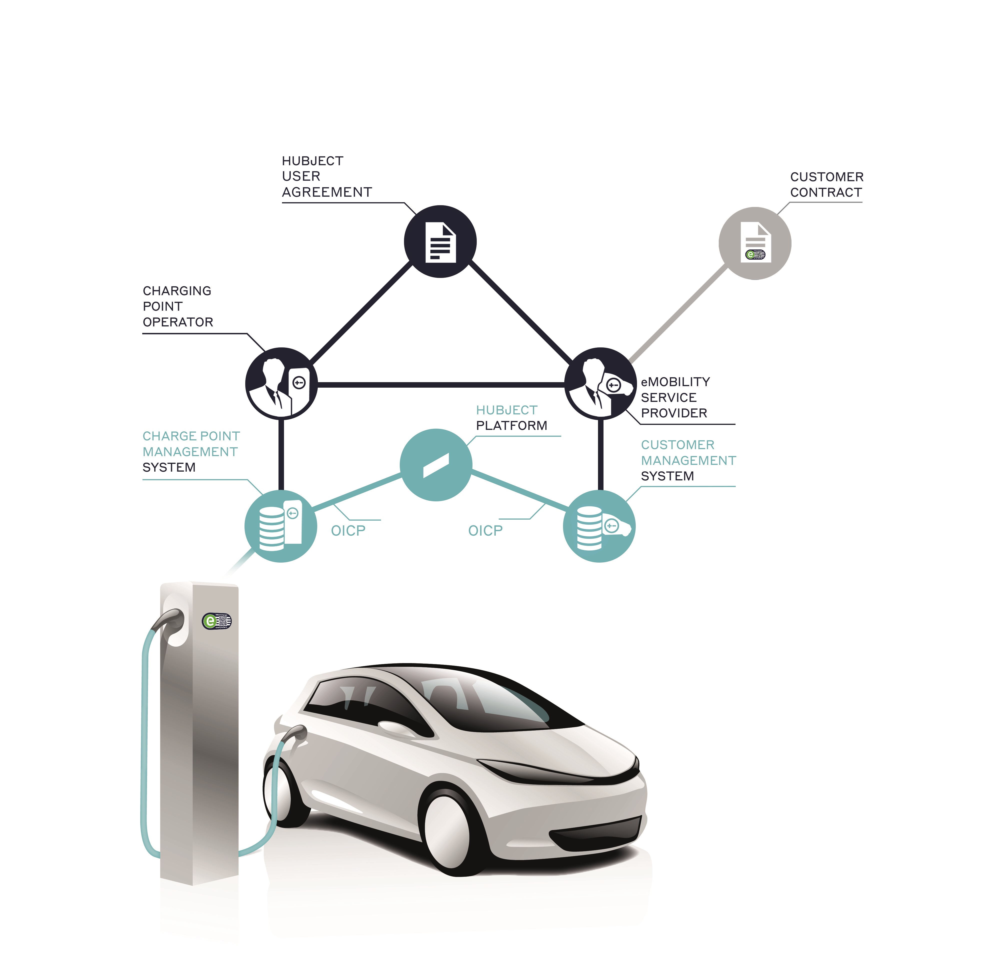
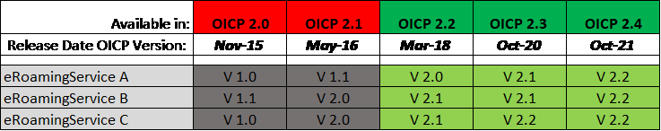

# Content

* [Introduction](#introduction)  
* [Communication Paradigms](01_CPO_Communication_Paradigms.asciidoc)
* [Services and Operations](02_CPO_Services_and_Operations.asciidoc)
* [Data Types](03_CPO_Data_Types.asciidoc)
* [Appendix File](04_Appendix.asciidoc)
* [Glossary and Abreviations](05_Glossary_and_Abreviations.asciidoc)
* [Code Snippets](06_CPO_Code_Snippets.asciidoc)

## Introduction
### The Hubject Platform

The goal of the “Hubject B2B Service Platform (HBS)” is to enable the electric mobility market by providing an information and transactional gateway for businesses such as charging infrastructure providers, mobility service providers and vehicle manufacturers.

The platform enabler functions include: 

* Ensuring the interoperability of the public and semi-public infrastructure through promotion of accepted standards within the network and open business user interfaces to the platform
* Simplification of authentication and authorization procedures through a trustworthy instance as well as safekeeping of sensitive data through the uncoupling of personal data and anonymous user data
* Automation of contract-based business relationships between power suppliers, car manufacturers, infrastructure service providers as well as further mobility business parties
* B2B information services for the realization of advanced services within the areas of energy management, traffic management, vehicle reservations, intelligent charging, car sharing and intermodal mobility

### The Charge Point Operator (CPO)
Hubject has been connecting various players in electric mobility since being founded in 2012. Hubject provides Europe-wide, customer-friendly charging for electric vehicles via eRoaming.

The two main partner groups are, on the one hand, providers of emobility services (EMP), which want to enable EV drivers to access charging infrastructure and, on the other hand, charge point operators (CPO), which want to boost the capacity utilization of their charging infrastructure.

Our solution for ChargePoint Operators: 

As a CPO, you can profit from our solution, intercharge CPO. It allows customers who have a contract with an EMP to charge their vehicles using your charging infrastructure via eRoaming. For this purpose, you need to get connected to the HBS (Hubject Brokering System) eRoaming platform. The HBS functions as an open electric mobility marketplace, which creates an open synergetic network that everyone profits from in the end.

### Scope

The information exchange between Hubject and CPO systems is entirely based on web service communication. This document describes the relevant service interfaces for CPO. The Open InterCharge Protocol (OICP) is the most widely implemented communication standard between EMP and CPO systems.

The information exchange is, in most cases, based on contractual relationships between EMPs and CPOs. In these cases, Hubject only processes service requests if there is a valid contract for the requested service. How EMPs and CPOs manage their service contracts is out of the scope of this document because the contract management aspects of the platform are used via a GUI-based system component.

### Conventions

The key words `MUST"`, `MUST NOT`, `REQUIRED`, `SHALL`, `SHALL NOT`, `SHOULD`, `SHOULD NOT`, `RECOMMENDED`, `MAY` and `OPTIONAL` in this document are to be interpreted as described in [RFC 2119](https://tools.ietf.org/html/rfc2119).  

### Overview

The following diagram gives an overview of all service operation messages that can be exchanged between Hubject and the corresponding EMP, respectively CPO systems.
 ["Services and Operations"](02_CPO_Services_and_Operations.asciidoc) chapter introduces the supported web services and the corresponding service operations in detail and defines the messages that will be exchanged between Hubject and partner systems. Chapter [Data Types](03_CPO_Data_Types.asciidoc) specifies the data types of the messages. Furthermore, every service is described in detail by a business process diagram, which is part of the [appendix](04_Appendix.asciidoc)

### Release management  

Hubject intends to pursue a release frequency; whereby, a new update of the OICP can be done within a time frame of two years with the HBS. The frequency of releases to be expected in the future should however not result in additional implementation complexity for partners, since each new release will lead to a new version of the affected services that will run in parallel to the current service version. Consequently, partners do not need to perform an upgrade with each new release, but will rather have the flexibility to choose which of the available valid service versions they wish to use. Service validity is dependent on the OICP version with which they are released (i.e. service versions available in deprecated OICP versions are only considered invalid and will not be supported by the HBS). Only service versions available in active OICP versions shall be supported. Each OICP version `MUST` be supported for two years by the HBS. 

See below for an example of the implications of the HBS release management approach

*NOTE*: 
>_the dates and content in the diagram below are strictly meant for explanation purposes only. This is not to be considered as an official communication of release dates

* Service versions: in this example, assuming the current date is October 15th 2021, only service versions highlighted in green will be supported by the HBS; whereas services highlighted in grey will no longer be supported, since these service versions are only available in deprecated OICP versions (i.e. the OICP versions highlighted in red). Consequently, partners can choose one of 3 valid service versions to implement for “Service A”, and one of 2 valid versions for “Service B” and “Service C”. 
* OICP versions: the OICP versions highlighted in red will not be supported by the HBS assuming the current date is 15th October 2021 since they are old therefore deprecated. Also, as depicted in the above example and in contrast to the HBS release management approach, more than two OICP versions can be supported simultaneously going forward.

All partners using the HBS `MUST` indicate the OICP version they are currently running in their system (i.e. OICP version being used in the communication with the HBS). On the database level however, the current specifications are to be implemented in all systems, i.e. new mandatory fields should be filled with a value.
### Further Documents

To enable a fast and efficient connection process between the Hubject Brokering System and Partner Systems, the following online webpage contains further information:

* [*support.hubject.com*](https://support.hubject.com/hc/en-us) – Contains all relevant information regarding the onboarding process and other technical information (e.g. Dynamic Pricing 1.0 - Functional Guide for Service Implementation)
* [*Release notes from OICP2.2 to OICP2.3*](https://github.com/hubject/oicp/blob/master/OICP-2.3/Realease_Notes.asciidoc)

### OICP protocol version and service versions

Beginning with OICP 2.1, service endpoints are versioned individually and independent of the OICP version. The table below therefore gives an overview of all web services and their current version within OICP version 2.3.
|Service |Version     |
|:---|:---:|
|eRoamingAuthorization|2.1   |   
|eRoamingChargeDetailRecord|2.2   |
|eRoamingReservation|1.1   | 
|eRoamingEVSEData|2.3   | 
|eRoamingEVSEStatus|2.1  | 
|eRoamingDynamicPricing|1.0   | 
|eRoamingChargingNotifications|1.1  | 

### Overview of Document Reviews  

The table below provides an overview of all changes made to this document after its initial publication. The changes documented below affect descriptions provided in this document and are mostly corrections or refinements of the specification details.

|Date of Update |Chapter Updated     | Comments |
|:---|:---:|:---|
|15th Septmeber 2020|OICP 2.3   |   Implementation description of the new OICP 2.3  
